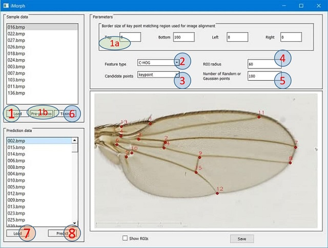

# About the project
This project studies methods on automatic morphometric landmark detections

In this repository, you can find following folders:

* Datasets: 5 public datasets for benchmarking purposes
* Vandaele_src: reimplemented the source code in Python for the method of Vandaele et al. [[1]](#1) 
* iMorph_src: source code of our framework and iMorph utility

# Download iMorph
Our framework was intergrated into iMorph utility whose pre-build executable files can be found [here](https://drive.google.com/drive/folders/1bJopUqd8p2xvp6Wr5J6yC8mOQChQmgP6)
# How to use iMorph

The landmark positions of each image (both sample and prediction data) are stored in a simple text file having the same name as the image
file, yet with ".txt" extension. Each row of coordinate text files holds the 2D coordinate of a landmark. Users can follow the below steps to process a dataset.

## Data preparation stage:
1. Load the sample data: locate the folder including sample images, each should go along with the corresponding text file
containing the positions of annotated landmark classes.

(a) Set the border size of key-point matching region used for image alignment

(b) Choose an image in the sample set as the alignment target image and select pre-process button to align all other
images in the sample set with the target image.
## Learning stage:

2. Select feature type: the utility supports 5 feature descriptors: SURF, Haar-like, LBP, R-HOG, and C-HOG
3. Select the candidate landmarks proposition method from 3 options: Key-point extraction, Random sampling, or Gaussian
sampling.
4. Select the sizes of the ROI.
5. Select the number of random points if the “Random” or "Gaussian" method is used in step 3.
6. Train to extract sample feature vectors from sample images
   
## Prediction stage:
7. Load the predict data: locate the folder including images to predict landmarks.
8. Predict: the tool predicts the location of landmark classes for each image in the prediction folder and saves the predicted
landmark positions into the corresponding coordinate text files.
Once an image name in Sample data or Prediction data panels is selected, the panel on the right will show the corresponding
image. If there exists the corresponding coordinate text file, the landmarks are plotted on the image to let the user check the
positions of landmark classes. In case the user does not satisfy, they can tune landmark classes by dragging and dropping them
to the desired positions, then click the "Save" button to overwrite the coordinate text file.

# How to build iMorph
Go to iMorph_src folder then:
### Make sure python 3 is available then setup the python libraries with below command
`pip install -r requirements.txt`

### Setup qttools5-dev-tools
#### in Windows
`pip install -r requirements.txt`
`pip install PyQt5`
`pip install PyQt5-tools`
#### in Ubuntu (linux)
`sudo apt-get install pyqt5-dev-tools`
`sudo apt-get install qttools5-dev-tools`

### Build the executable file
`pyinstaller --onefile  --windowed iMorph.py`

## References
<a id="1">[1]</a> 
Vandaele, R., Aceto, J., Muller, M. et al. Landmark detection in 2D bioimages for geometric morphometrics: a multi-resolution tree-based approach. Sci Rep 8, 538 (2018). https://doi.org/10.1038/s41598-017-18993-5